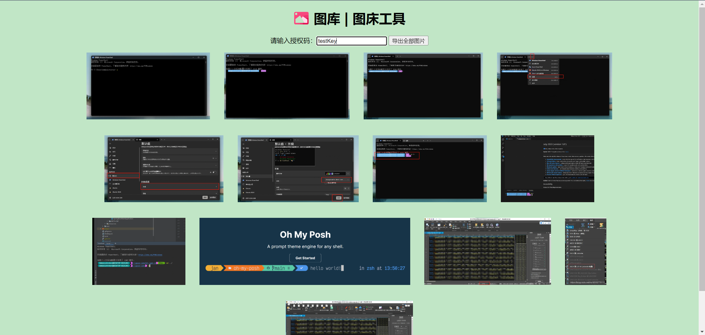

# image-oss
image-oss

## 简介

image-oss初衷是搭建一个 个人图床服务。演示站：[http://image-oss-demo.oldmoon.top/](http://image-oss-demo.oldmoon.top/)

> 互联网各种图床看的眼花缭乱，用起来还需要配置各种东西，所以我想搭建一个自己的图床服务，这样用起来更加顺手。

## 快速开始

### Docker-Compose

- docker-compose.yml示例

```yaml
version: "3"

services:
  image-oss:
    image: dingdangdog/image-oss:latest
    restart: always
    environment:
      TZ: "Asia/Shanghai"
    volumes:
      - ${PWD}/images:/data/image-oss/images
      - ${PWD}/application.yml:/usr/image-oss/jar/application.yml
    ports:
      - 11080:80
```

1. 建议在服务器上创建独立的文件夹，将项目根目录下的`docker-compose.yml`和`application.yml`拷贝到服务器的文件夹下。

2. 修改`application.yml`中的部分配置

   - **必须修改的配置项**，将其中`http://localhost:80`修改为你自己图床服务的地址，比如演示站地址`http://image-oss-demo.oldmoon.top`：

     ```yaml
     # 服务信息配置
     info:
       server-url: http://localhost:80
     ```

   - **建议修改的配置**，参考下方注释自行修改即可：

     ```yaml
     # 个人认证码（授权码）配置
     user:
       # 个人授权码集合，可以多个
       key-map:
         # test可以理解为用户名，testKey是用户test的个人授权码
         testKey: test
         # test2可以理解为用户名，testKey2是用户test2的个人授权码
         testKey2: test2
     ```

     

3. 在`docker-compose.yml`和`application.yml`的所在文件夹下，执行如下指令，会自动拉取`image-oss`的最新镜像并启动：

   ```sh
   docker-compose up -d
   ```

### 端口占用

通过本项目提供的`docker-compose.yml`部署，若不做任何修改，将占用宿主机（服务器）一个端口：`11080`。

### 注意事项

1. 个人授权码是必须的，在快速开始中**建议修改的配置**就是用于维护个人授权码的；
2. 用户名不换，授权码更换，仍然会认为是同一个用户（图片保存到同一个目录下）；
3. **前端页面中，个人授权码必须填写正确的，否则几乎所有功能都无法使用**；
4. 在前端输入个人授权码并成功上传一次图片后，*授权码会保存至浏览器缓存中*，在不清除缓存的情况下，下次打开页面将自动填充授权码，水印同理。
5. 水印目前仅支持`jpg,jpeg,png`三种文件类型，其他类型图片上传时，请清空页面**`请输入水印内容`**的输入框，否则将导致上传失败。
6. 如果是互联网图床，建议服务器带宽在10M以上，否则上传文件较大容易引起超时异常。
7. 目前服务支持默认支持30M的文件上传，如有需求可按需修改，最大可改为50M。
7. 水印还不支持中文。。。相信我会尽快支持的。。。

## 常见报错

- `No Permission!`：无权限，请检查个人授权码是否正确。
- `Uploaded file type is not supported!`：不支持上传的文件类型。
- `The file type with watermark is not supported!`：不支持加水印的文件类型。
- `Unknown Exception!`：在文件处理时出现了预期外的异常，出现这个错误时，建议提交`ISSUE`。
- `System Error!`：系统错误，常见原因可能是：服务端未知异常、网络连接异常。

**如果你有任何其他问题，都可以提交ISSUE！**

## 技术点

- Java - springboot
- html + css + javascript
- nginx
- docker

## 实现原理


### 后端

后端使用springboot开发一个微服务，提供接口，以支持图片上传和导出等主要功能。

### 前端

> 前端是一个非常简单的`html`文件，初期服务端只提供后端接口支持，觉得多终端用起来挺麻烦，所以现在已将前端也融合到docker镜像中。

现在使用最新版docker镜像部署，直接访问服务即可获得前端页面。

### Nginx

Nginx在项目中起到很重要的作用，主要有：

1. 前端页面访问；
2. 图片资源查看（图片、图库）；
3. 后端服务转发。

但大家可以放心，如果你不懂Nginx也可以轻松使用，Nginx相关配置已经集成到Docker容器中，不做任何修改即可直接使用。

## 演示站

演示站一般是最新的版本：[http://image-oss-demo.oldmoon.top/](http://image-oss-demo.oldmoon.top/)

个人授权码可以使用`testKey`和`testKey2`进行测试。

**不要瞎搞哦，演示站服务器很脆弱，磁盘空间很小，也没啥重要的东西，崩了就重装系统。。。😉**

### 使用效果示例

> 示例页面可能与最新版页面有所差异，但功能大致相同。


### 最新功能：增加图库在线查看图片


