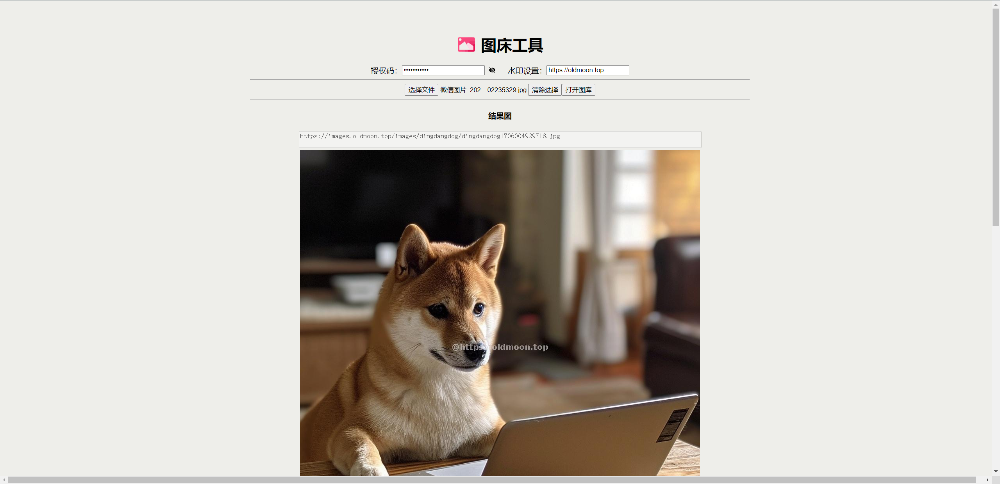
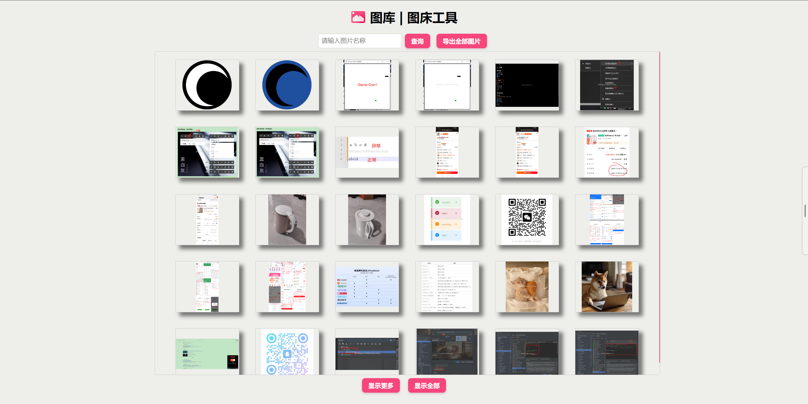

# image-oss

## About

The original intention of image-oss is to build a **Personal image storage service**.

And now, it provides a simple visual operation page.

> The various image beds on the Internet are dazzling to see, and you need to configure various things to use them, so I want to build my own image bed service to make it easier to use.

## Necessary

If want to deploy `dingdangdog/image-oss`, You need An `application.yml` config file. You can find it content from [application.yml](https://github.com/dingdangdog/image-oss/blob/main/src/main/resources/application.yml).

You need create `application.yml` config file, the storage path must correspond to the configuration in `docker-compose.yml`.

If you use this example `docker-compose.yml`, you should should make sure `docker-compose.yml` and `application.yml` stay together in a folder.

## docker-compose.yml Demo
```yaml
version: "3"

services:
  image-oss:
    image: dingdangdog/image-oss:latest
    restart: always
    environment:
      TZ: "Asia/Shanghai"
    volumes:
      - ${PWD}/images:/data/image-oss/images
      - ${PWD}/application.yml:/usr/image-oss/jar/application.yml
    ports:
      - 11080:80
```

## Plan

- [ ] Google Chrome plug-in
- [ ] Multi-language support
- [ ] More...

> waiting forever···

## Demo

[More Information (Chinese)](./MoreInfo.md)

### Main function

> PS: The sample page may differ from the latest version, but will function roughly the same.


### Gallery function

- 主界面

- 图库


## Notice

**I will try my best to do it well.**
